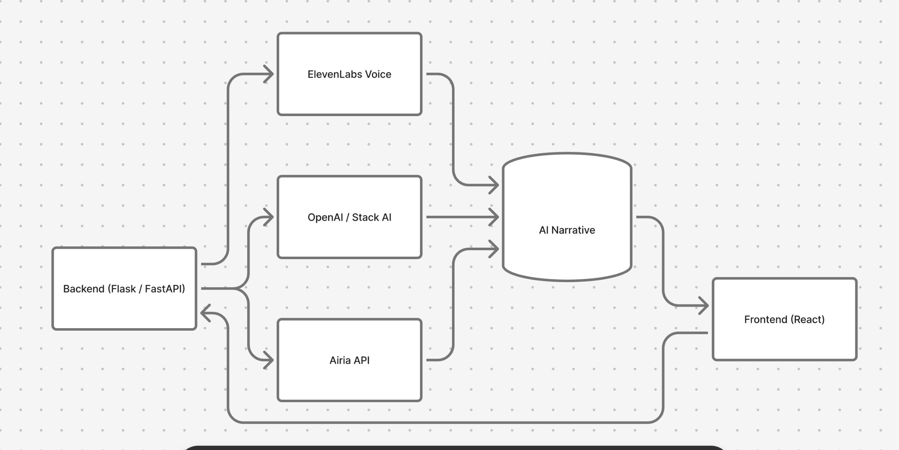
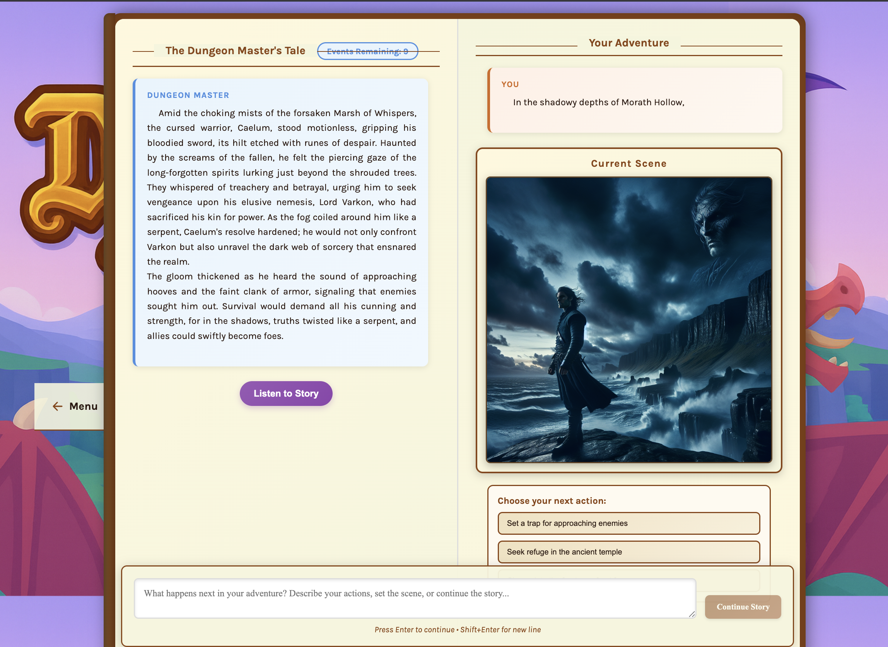
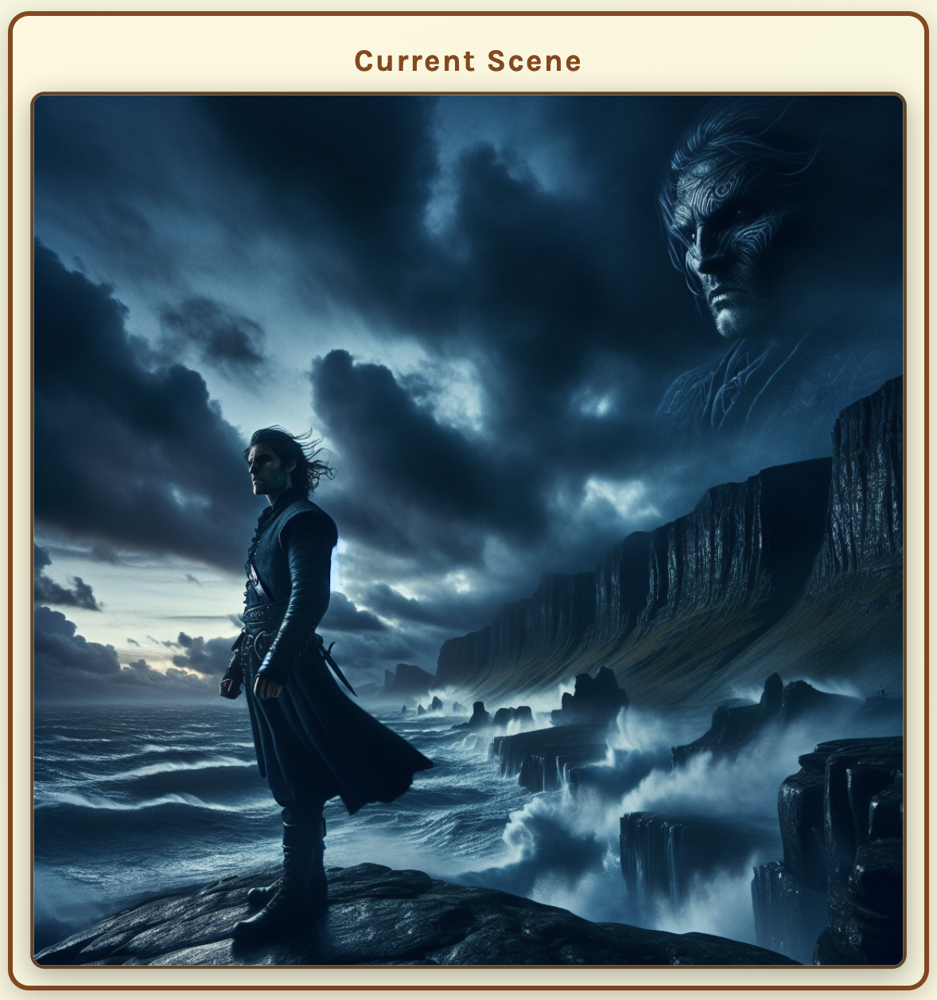
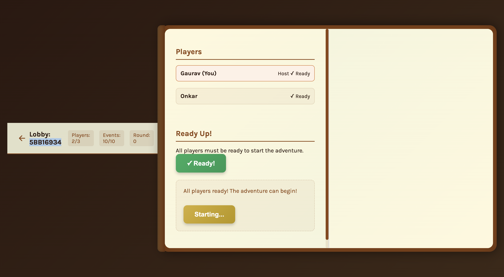

# 🏰 **Dungeon Forge: The AI Dungeon Master Storybook**

> *“Forge your destiny — co-create epic adventures with AI.”*


---

## 🌌 **Overview**

**Dungeon Forge** is an **AI-powered storytelling forge** where you and your friends co-create legendary adventures.  
Each page unfolds dynamically — guided by your imagination and powered by **Airia**, **Stack AI**, **OpenAI**, and **ElevenLabs**.

Step into a realm where your words shape worlds, your choices summon quests, and your AI companion becomes the Dungeon Master.

---

## Try It Here -> https://dungeonforge-contenthack2025-1.onrender.com

## ⚔️ **Core Features**

| Feature | Description |
|:--|:--|
| 🧙‍♂️ **AI Dungeon Master** | Generates living worlds, quests, and dialogues in real-time. |
| 🎨 **Visual Story Generation** | Turns your key moments into cinematic fantasy scenes. |
| 🎭 **Voice of the Realm** | Integrates **ElevenLabs**, **Airia**, and **Stack AI** for immersive narration. |
| 📖 **Dual-Page Storybook UI** | Left page = AI writes, Right page = you continue your journey. |
| 👥 **Multiplayer Mode** | Invite 2–3 friends and co-create stories in shared dungeons. |
| ⚡ **Two Modes of Creation** | “Continue Story” (fast) or “With Scene Art” (AI image + text). |

---

## 🛠️ **Tech Stack**

| Layer | Tech |
|-------|------|
| **Frontend** | React ⚛️ • Tailwind CSS 💨 • Vite ⚡ |
| **Backend** | Flask 🐍 • FastAPI 🚀 |
| **AI** | Airia • Stack AI • OpenAI |
| **Audio** | ElevenLabs 🎧 |
| **Deployment** | Netlify 🌐 • Render ☁️ |

---

## 🧩 **System Flow**



---

## 🪄 **Setup**

1. **Add your Airia credentials** to `.env`:

   ```bash
   AIRIA_API_KEY=your-airia-api-key-here
   AIRIA_USER_ID=your-airia-user-id-guid-here
   ```
   
   ⚠️ **Important:** `AIRIA_USER_ID` must be a valid GUID (UUID format), e.g., `cafe22b2-b79d-408e-b762-d6a7d54e5802`
   
   The backend will automatically validate and generate a GUID if an invalid one is provided.

2. **Install backend**

   ```bash
   cd backend
   python3 -m venv venv
   source venv/bin/activate
   pip install -r requirements.txt
   python app.py
   ```

3. **Install frontend**

   ```bash
   cd frontend
   npm install
   npm start
   ```

---

## 💻 **Usage**

- **Backend:** http://localhost:8001  
- **Frontend:** http://localhost:3000  

### ✨ Two Ways to Continue Your Story:
| Mode | Description |
|------|--------------|
| 📝 **Continue Story** | Text-only continuation (fast mode). |
| 🎨 **With Scene Art** | Story text + AI-generated fantasy image. |

---

## 📖 **Interface Overview**

The interface mimics an **open enchanted storybook**:

| Area | Purpose |
|------|----------|
| **Left Page** | AI Dungeon Master narrates the unfolding tale. |
| **Right Page** | You write your actions, choices, and responses. |
| **Bottom Bar** | Input area to continue your adventure. |

---

## 🌠 **Example**

You type:  
> “You enter a dark cave filled with glowing crystals.”

- 📝 **Continue Story:** Instantly receive a vivid continuation.  
- 🎨 **With Scene Art:** Generate both story text + fantasy scene.

---

## ⚙️ **Run Commands**

**Terminal 1 — Backend**
```bash
cd backend
source venv/bin/activate
python app.py
```

**Terminal 2 — Frontend**
```bash
cd frontend
npm start
```

---

## 🖼️ **Screenshots**

| Storybook | Scene Generation | Multiplayer |
|------------|------------------|--------------|
|  |  |  |

---

## 🔧 **Recent Updates**

- ✅ Updated Airia API integration with improved error handling
- ✅ Enhanced logging for debugging API issues
- ✅ GUID validation for Airia user IDs
- ✅ Improved JSON response parsing
- ✅ Mobile web app support (meta tags)
- ✅ Stack AI image generation integration

## 🌌 **Roadmap**

- [x] AI text generation  
- [x] Storybook UI  
- [x] ElevenLabs integration  
- [x] Multiplayer sync mode  
- [x] Airia API integration with GUID support
- [x] Enhanced error handling and logging
- [ ] Persistent save/load stories  
- [ ] Character avatars  
- [ ] Map creation  

---

## 🪶 **Credits**

Built for **Content Hack 2025** by  
**Gaurav Hungund**, **Onkar Bedekar**,**Sriram Madduri**,**Suhaas Srungavarapu** ⚔️  

> “In every line of code lies a story waiting to be told.”
